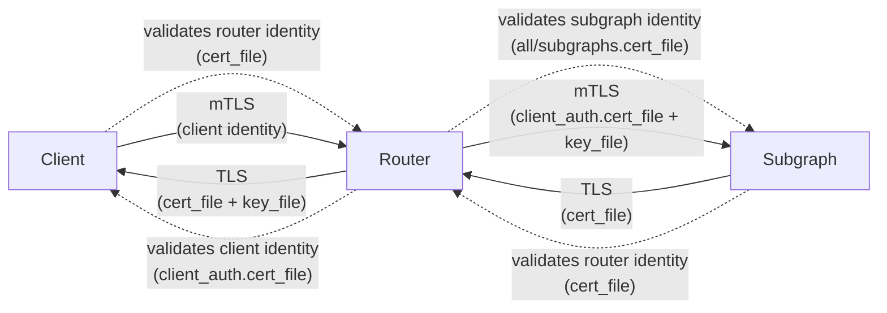

# TLS Support

Adds TLS support to Hive Router for both client and subgraph connections, including mutual TLS (mTLS) authentication. This allows secure communication between clients, the router, and subgraphs by encrypting data in transit and optionally verifying identities.

### TLS Directions

TLS Support has implementations for the following 4 directions:

#### Router -> Client - Regular TLS
Router has an `identity` (`cert`, `key`), and client has `cert`, then Client validates the router's `identity`

#### Client -> Router - mTLS
Router has the `cert`, client has the `identity`, mTLS/Client Auth then the router validates the client's `identity`

#### Subgraph -> Router - Regular TLS
Subgraph has the `identity` (`cert`, `key`), and router has `cert`, then Router validates the subgraph's `identity`.

#### Router -> Subgraph - mTLS
Subgraph has the `cert`, router(which is the client this time) has the `identity`, then subgraph validates the router's `identity`.

### TLS Directions Diagram



### Configuration Structure
```yaml
traffic_shaping:
  router:
    key_file:          # Router server private key
    cert_file:         # Router server certificate(s)
    client_auth:       # mTLS: Client -> Router
       cert_file:      # Trusted client CA certificate(s)
  all:                 # Default TLS for all subgraph connections
    cert_file:         # Trusted subgraph CA certificate(s)
    client_auth:       # mTLS: Router -> Subgraph
       cert_file:      # Router client certificate(s)
       key_file:       # Router client private key
  subgraphs:
    SUBGRAPH_NAME:     # Per-subgraph TLS override
      cert_file:       # Trusted subgraph CA certificate(s)
      client_auth:     # mTLS: Router -> Subgraph
         cert_file:    # Router client certificate(s)
         key_file:     # Router client private key
```
