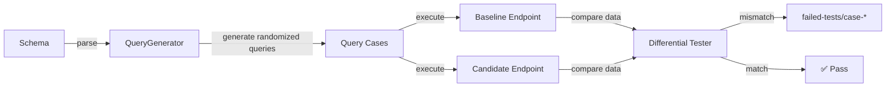

# GraphQL Differential Testing

`graphql-diff` performs differential testing between two GraphQL endpoints.

It generates randomized GraphQL operations from a schema, sends the same operation and variables to both endpoints, and compares the returned `data` payloads. When the payloads differ, it writes the query, variables, and both responses to `failed-tests/case-*` for inspection.



## In this repository

The intended benchmark comparison is:

- `bench/monolith-js`: a GraphQL Yoga monolith that acts as the monolithic baseline
- `bench/subgraphs` behind the router: the federated candidate being compared against the baseline

`bench/monolith-js` gives the differential test a meaningful reference point. It serves the same benchmark domain data and near-equivalent resolver behavior as the federated benchmark stack, so differences in results are easier to attribute to execution behavior rather than unrelated domain differences.

## What the binary does

- Parses a schema document
- Generates randomized queries with aliases, duplicate response keys, fragments, inline fragments, and directives
- Sends the same query and variables to both endpoints
- Compares `response.data` from both results
- Writes mismatches to `failed-tests/case-*`

The binary compares `data` only. It does not require the exact same `errors` payload from both endpoints.

## Usage

```bash
cargo run -p graphql-differential -- \
  http://localhost:4300/graphql \
  http://localhost:4000/graphql \
  bench/schema.graphql
```

Arguments:

- `baseline-endpoint`: the reference implementation
- `candidate-endpoint`: the implementation being compared
- `schema.graphql`: the schema used to generate queries

Environment:

- `GRAPHQL_DIFF_QUERIES`: number of generated queries to run

Example:

```bash
GRAPHQL_DIFF_QUERIES=250 cargo run -p graphql-differential -- \
  http://localhost:4300/graphql \
  http://localhost:4000/graphql \
  bench/schema.graphql
```

## Output

When a case differs, the binary creates a directory like `failed-tests/case-8/` containing:

- `query.graphql`
- `variables.json`
- `endpoint-1.json`
- `endpoint-2.json`

These files are the primary debugging artifact for investigating behavioral differences between the baseline and candidate implementations.
