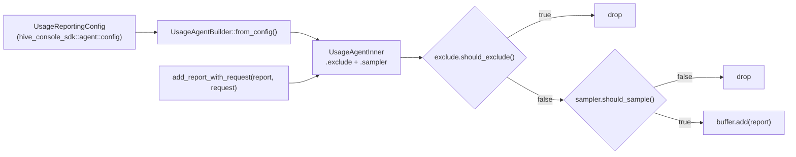

# Usage Reporting Refactor

This document tracks the redesign of `telemetry.hive.usage_reporting`. It started as a sampler change (replacing the flat `sample_rate` knob with a tagged `sampler` config that also supports `at_least_once`), and grew into a wider cleanup that pulled the Apollo Router plugin and `hive-router` onto the same shared types. Below is each change with the motivation that drove it.

**Breaking change.**

## Changes summary

1. [New `sampler` config (`fixed` / `at_least_once`)](#1-new-sampler-config-fixed--at_least_once)
2. [Sampling, exclusion and agent construction unified in `hive-console-sdk`](#2-sampling-exclusion-and-agent-construction-unified-in-hive-console-sdk)
3. [`UsageAgentBuilder::from_config` is the only YAML-driven setter](#3-usageagentbuilderfrom_config-is-the-only-yaml-driven-setter)
4. [Single `UsageReportingExclude` field replaces two separate fields](#4-single-usagereportingexclude-field-replaces-two-separate-fields)
5. [Shared SDK primitives (`Percentage`, `RetryPolicyConfig`, `CircuitBreakerConfig`, `TargetId`)](#5-shared-sdk-primitives)
6. [Apollo Router plugin: field names and types aligned with the SDK](#6-apollo-router-plugin-field-names-and-types-aligned-with-the-sdk)
7. [Order of checks in the agent: exclude before sample](#7-order-of-checks-in-the-agent-exclude-before-sample)

The remaining sections cover the [differences from the JavaScript Hive client](#differences-from-the-javascript-hive-client), the [migration](#migration), [testing](#testing) and [open questions](#open-questions--future-work).

## 1. New `sampler` config (`fixed` / `at_least_once`)

### Motivation

`sample_rate` is fine for "give me 10% of everything", but it has a well-known failure mode: rare operations can be sampled out for so long that they look like they don't exist. The other Hive client SDKs ship an [`atLeastOnceSampler`](https://the-guild.dev/graphql/hive/docs/api-reference/client#at-least-once-sampling) strategy that fixes this, and we want feature parity in `hive-router` and the Apollo Router plugin.

We also want a config shape that can grow without further breaking changes (e.g. a future `dynamic` strategy or a recursive sampler), instead of bolting more flat fields next to `sample_rate`.

### What changed

`telemetry.hive.usage_reporting.sample_rate` is removed. A new `sampler` field takes its place:

```yaml
telemetry:
  hive:
    usage_reporting:
      # Strategy 1: fixed rate (replaces the old `sample_rate` field).
      sampler:
        type: fixed
        rate: 90%

      # Strategy 2: at-least-once per key.
      sampler:
        type: at_least_once
        key: operation_name      # constant; or `key: { expression: "..." }`
        rate: 10%                # rate applied to subsequent occurrences after the first per key
        max_seen_keys: 1000      # upper bound on the in-memory seen-set
```

Defaults:

- `sampler` omitted → `{ type: fixed, rate: 100% }`.
- Inside `at_least_once`:
  - `key` omitted → `operation_name`.
  - `rate` omitted → `0%` (only the first occurrence per key is sampled, which matches what the strategy name implies).
  - `max_seen_keys` omitted → `1_000`. Matches the other in-process caches in the router (parse/validate/plan caches all default to 1k entries) and comfortably covers a typical GraphQL API's distinct-operation cardinality. Operators with high-cardinality VRL keys (e.g. headers) can raise it. Once full, the least-recently-used keys are evicted and treated as "first occurrence" again next time they are seen.

### Why `fixed` (not `static`)

`fixed` is short, behavioral (the rate doesn't change over time), and pairs naturally with `at_least_once`. We considered:

- `static`: only makes sense in opposition to a `dynamic` peer we are not shipping.
- `random`: describes the mechanism but is less self-evident next to `at_least_once`.

### Config types (SDK side)

Defined in [`lib/hive-console-sdk/src/agent/config.rs`](../../lib/hive-console-sdk/src/agent/config.rs):

```rust
#[derive(Debug, Deserialize, Serialize, JsonSchema, Clone)]
#[serde(tag = "type", rename_all = "snake_case", deny_unknown_fields)]
pub enum SamplerConfig {
    Fixed {
        #[schemars(with = "String")]
        rate: Percentage,
    },
    AtLeastOnce {
        #[serde(default)]
        key: AtLeastOnceKey,
        /// Rate applied to subsequent occurrences after the first per `key`.
        #[serde(default = "default_at_least_once_rate")]
        #[schemars(with = "String")]
        rate: Percentage,
    },
}

#[derive(Debug, Serialize, Deserialize, JsonSchema, Clone)]
#[serde(untagged)]
pub enum AtLeastOnceKey {
    Constant(AtLeastOnceKeyConstant),
    Expression { expression: String },
}

#[derive(Debug, Default, Serialize, Deserialize, JsonSchema, Clone, Copy)]
#[serde(rename_all = "snake_case")]
pub enum AtLeastOnceKeyConstant {
    #[default]
    OperationName,
}
```

Keeping the constants in their own enum (rather than a free-form string) means unknown values are rejected at deserialization time and the generated JSON schema constrains the constant to `enum: ["operation_name"]`.

### Runtime sampler

Defined in [`lib/hive-console-sdk/src/agent/sampler.rs`](../../lib/hive-console-sdk/src/agent/sampler.rs):

- `Sampler::Fixed { rate }`: `rate >= 1.0` → `true`, `rate <= 0.0` → `false`, otherwise `rand::rng().random_bool(rate)`.
- `Sampler::AtLeastOnce { key, rate, seen }`:
  1. Resolve the key. For the constant `operation_name` we look it up by `&str` first (`seen.contains_key(op_name)`) so subsequent occurrences (the hot path) do not allocate a new `String`; only the very first occurrence per key pays for `to_owned()`. For an `expression` key we always evaluate the VRL `program` against the same value used by `exclude` and own the resulting `String`.
  2. The first occurrence per key is detected with the atomic `seen.entry(...).or_insert(()).is_fresh()`. Concurrent threads racing on the same missing key still get exactly one "first occurrence" winner.
  3. Subsequent occurrences fall through to `rand::rng().random_bool(rate)`.

The `seen` set is a [`moka::sync::Cache<String, ()>`](https://docs.rs/moka/latest/moka/sync/struct.Cache.html) bounded by `max_seen_keys`. Once the configured limit is reached, moka evicts entries (TinyLFU admission + LRU eviction); evicted keys are treated as a fresh "first occurrence" the next time they appear. The cache is owned by the agent (a per-process singleton), so `at_least_once` state is shared across requests but not across processes.

## 2. Sampling, exclusion and agent construction unified in `hive-console-sdk`

### Motivation

`hive-router` and the Apollo Router plugin used to maintain their own copies of the same configuration types (`UsageReportingConfig`, `SamplerConfig`, `AtLeastOnceKey`, `UsageReportingExclude`) and their own `compile_sampler` helpers. Every change had to land in two places, with the usual risk of drift. The configuration types live alongside the agent that consumes them, so the natural home for them is the SDK itself.

### What changed

`hive_console_sdk::agent::config` now exposes `UsageReportingConfig`, `SamplerConfig`, `AtLeastOnceKey` and `UsageReportingExclude`. Both routers consume these types directly:

- `hive-router-config::telemetry::HiveTelemetryConfig` holds a `UsageReportingConfig` field.
- The Apollo plugin's `Config` `#[serde(flatten)]`s `UsageReportingConfig` next to its plugin-only fields (`token` / `target` / `client_name_header` / ...).

The runtime sampler and exclusion filter (`Sampler::from_config`, `Exclude::from_config`) live next to the config types so VRL compilation, key resolution and the `seen` set are implemented once. Both routers now share the same `UsageAgent`.



The router pipeline ([`bin/router/src/pipeline/usage_reporting.rs`](../../bin/router/src/pipeline/usage_reporting.rs)) shrinks accordingly: the inline `sample_rate` short-circuit, the local `compile_sampler` helper and the inline operation-name exclusion check are all removed in favor of the SDK code path.

## 3. `UsageAgentBuilder::from_config` is the only YAML-driven setter

### Motivation

The previous builder had one setter per config knob (`endpoint`, `buffer_size`, `connect_timeout`, `request_timeout`, `accept_invalid_certs`, `flush_interval`, `retry_policy`, `max_retries`, ...). Every consumer had to write the same long chain of `.endpoint(...).buffer_size(...).flush_interval(...)` calls just to forward YAML defaults. This made it easy to forget a knob and harder to keep the SDK and its consumers in sync.

### What changed

`UsageAgentBuilder` is intentionally narrow now. Anything that comes from YAML goes through one method:

```rust
pub fn from_config(self, config: &UsageReportingConfig) -> Result<Self, AgentError>;
```

The remaining setters cover values that come from runtime context, not YAML:

```rust
pub fn token(self, token: String) -> Self;
pub fn target_id(self, target_id: TargetId) -> Self;
pub fn user_agent(self, user_agent: String) -> Self;
```

`from_config` also performs VRL compilation (`exclude.expression`, `sampler.key.expression`) so misconfigured expressions surface synchronously as `AgentError::ExcludeError(_)` / `AgentError::SamplerError(_)` when the agent is built. `target_id` takes the validated `TargetId` newtype rather than a raw `String`, so the agent does not need a separate validation step.

## 4. Single `UsageReportingExclude` field replaces two separate fields

### Motivation

`exclude_expression: Option<String>` and `exclude_operation_names: Option<HashSet<String>>` were two flat fields representing the same concept ("which operations should the agent drop?"). Apart from being awkward, they could both be set at the same time and required ad-hoc precedence rules.

### What changed

The two fields are merged into one untagged sum type that lives in the SDK:

```rust
#[derive(Debug, Deserialize, Serialize, JsonSchema, Clone)]
#[serde(untagged)]
pub enum UsageReportingExclude {
    Expression { expression: String },
    OperationNames(Vec<String>),
}
```

YAML side: `exclude` is either a bare list of operation names or an object with a VRL expression, never both:

```yaml
usage_reporting:
  exclude: ["IntrospectionQuery", "HealthCheck"]
  # or:
  exclude:
    expression: '.request.headers."x-skip-usage" == "true"'
```

The Apollo plugin used to hand-roll the operation-name check inside `populate_context`; that branch is removed and the agent now applies both forms uniformly.

## 5. Shared SDK primitives

A few cross-cutting types were promoted to `hive_console_sdk::primitives` so every consumer (usage reporting, persisted documents, traffic shaping, telemetry) deserializes them with the same shape and JSON schema.

### `Percentage`

Already SDK-shaped; just moved out from under `hive_router_config::primitives` so `SamplerConfig.rate` can use it without depending on `hive-router-config`.

### `RetryPolicyConfig`

#### Motivation

The router had three places defining "a retry policy from YAML": usage reporting, persisted documents and the supergraph fetcher. They were all spelled the same way (`max_retries`) but lived in three different structs.

#### What changed

`hive_console_sdk::primitives::retry_policy::RetryPolicyConfig` is now the single retry config used by all three. It defaults to 3 retries and converts into `retry_policies::policies::ExponentialBackoff` via `From<&RetryPolicyConfig>`. `telemetry.hive.usage_reporting.retry_policy.max_retries` is now configurable too (it used to be hard-coded inside the SDK).

### `CircuitBreakerConfig`

#### Motivation

Subgraph traffic shaping already had a circuit-breaker config, but the usage reporting agent built its own circuit breaker with hard-coded thresholds. Same shape, two definitions.

#### What changed

`hive_console_sdk::primitives::circuit_breaker::CircuitBreakerConfig` is the single shape used by every circuit breaker in the router. All four fields (`error_threshold`, `volume_threshold`, `reset_timeout`, `half_open_attempts`) are optional; when omitted, the SDK applies its defaults (50% error threshold, rolling sample of 5, 30s reset timeout, 10 half-open probes).

Two consumers wrap it differently:

- `traffic_shaping.{all,subgraphs.<name>}.circuit_breaker` `#[serde(flatten)]`s it next to subgraph-specific fields (`enabled`, `error_status_codes`). The YAML shape is unchanged.
- `telemetry.hive.usage_reporting.circuit_breaker` exposes it as an optional override (`Option<CircuitBreakerConfig>`); omit the field to keep the SDK defaults, set it to override individual knobs.

A `CircuitBreakerConfig::merged_with(&fallback)` helper fills `None` fields from a fallback, which is what the executor uses to layer subgraph-level config over the global one before turning it into a `CircuitBreakerBuilder` via `From<&CircuitBreakerConfig>`.

### `TargetId`

#### Motivation

The Hive Console target id (slug `$organizationSlug/$projectSlug/$targetSlug` or UUID) was validated at agent startup with a free-floating regex. Misconfigured ids surfaced late, were spelled `String` in every signature, and couldn't be highlighted in YAML editors.

#### What changed

`hive_console_sdk::primitives::target_id::TargetId` is a validated newtype with a custom JSON schema (`oneOf` of two regex patterns). `telemetry.hive.target` and the Apollo plugin's `target` field both use `TargetId`, so:

- Misconfigured ids fail at config-load time with a YAML-editor-visible schema error instead of a runtime crash.
- `UsageAgentBuilder::target_id` takes `TargetId` directly, so the agent does not need a separate validation step.
- Existing valid values (slug or UUID) keep working unchanged.

## 6. Apollo Router plugin: field names and types aligned with the SDK

### Motivation

The Apollo plugin had been carrying the same configuration twice: its own `Config` plus a parallel implementation of the SDK types, with subtly different field names (`registry_token` vs `token`, integer-seconds vs humantime durations, `enabled: true` vs `enabled: false`). Aligning the plugin's `Config` with the SDK's `UsageReportingConfig` removes the duplication and makes one shared changelog enough to describe both.

### What changed

The plugin's `Config` now `#[serde(flatten)]`s `UsageReportingConfig` and only keeps what the Apollo plugin actually owns:

- `token` / `target` (with env var fallbacks `HIVE_TOKEN` / `HIVE_TARGET_ID`).
- `client_name_header` / `client_version_header` (Apollo header conventions).

This is a breaking change to the plugin YAML on top of the `sample_rate` removal:

| Before                                  | After                                                  |
| --------------------------------------- | ------------------------------------------------------ |
| `registry_token: ...`                   | `token: ...`                                           |
| `registry_usage_endpoint: ...`          | `endpoint: ...`                                        |
| `connect_timeout: 5` (seconds, integer) | `connect_timeout: 5s` (humantime string)               |
| `request_timeout: 15`                   | `request_timeout: 15s`                                 |
| `flush_interval: 5`                     | `flush_interval: 5s`                                   |
| `sample_rate: 90%`                      | `sampler: { type: fixed, rate: 90% }`                  |
| `enabled` defaults to `true`            | `enabled` defaults to `false`, set it explicitly to opt in |

Environment variable fallbacks `HIVE_TOKEN`, `HIVE_TARGET_ID` and `HIVE_ENDPOINT` still work the same way.

The previous `populate_context` block rolled its own random sampler and operation-name exclusion check; both branches go away because the agent now owns those decisions (`Sampler` and `Exclude`). `OperationContext.dropped` and `OperationConfig.exclude` are removed accordingly.

## 7. Order of checks in the agent: exclude before sample

### Motivation

Previously the router pipeline applied `sample_rate` first and the operation-name exclusion check later. With `at_least_once` that ordering becomes wrong: an operation that is going to be excluded shouldn't claim "first occurrence" status in the `seen` set, because its first occurrence is never reported. Reversing the order keeps `at_least_once` honest.

### What changed

Inside `UsageAgentInner::add_report_with_request` the order is now:

1. `exclude.should_exclude(report, request)`: drop if `true`. Both static operation-name lists and VRL expressions are evaluated here.
2. `sampler.should_sample(report, request)`: drop if `false`.
3. Add to buffer; flush on size/interval as before.

Compile / evaluation errors surface as `AgentError::ExcludeError(_)` / `AgentError::SamplerError(_)`.

## Differences from the JavaScript Hive client

The [JavaScript `atLeastOnceSampler`](https://the-guild.dev/graphql/hive/docs/api-reference/client#at-least-once-sampling) was the reference design here. Operationally we behave the same way: the first occurrence per key is reported, and every subsequent occurrence with the same key is decided probabilistically. The shapes of the two APIs differ in a couple of places that are worth calling out explicitly so the parity question doesn't keep coming up:

- **`rate` is static, JS's `sampler` is a function.** In JS, `atLeastOnceSampler({ keyFn, sampler })` takes a `sampler(samplingContext) => number | boolean` that can return a different rate per request (per operation, per header, per time of day, ...). Our config takes a single `Percentage` instead. The reason is that the natural escape hatch in YAML config is VRL, and VRL expressions are stateless: they can compute a rate from the request, but they cannot maintain the `seen` set that `at_least_once` needs. The common pattern in the JS SDK is a constant rate anyway (e.g. `sampler: () => 0.1`), which maps 1:1 to `rate: 10%`. A static `rate` covers that case without committing us to a half-stateful expression API.
- **Top-level `dynamic` strategy.** JS does not need an explicit "dynamic" strategy because the `sampler` callback is already dynamic. We do not ship a `type: dynamic` (`expression: "..."` returning a boolean) variant for now; it is purely additive and can be introduced as a third `SamplerConfig` variant without a breaking change once we have a real ask.
- **`keyFn` vs `key`.** JS takes a function. We take a small enum: a constant (`operation_name`, the only currently-supported and default constant) or `{ expression: "..." }` for arbitrary VRL keys (headers, persisted document hash, etc.). Functionally equivalent for the common case, with a typed default for the most common one.
- **Default rate.** JS makes `sampler` mandatory. We default `rate` to `0%` inside `at_least_once`, which means "only the first occurrence per key", i.e. the literal reading of the strategy name.
- **`seen` set bounds.** The JS client keeps the seen-set unbounded (a plain `Map<string, true>` for the lifetime of the process). We use a bounded `moka::sync::Cache<String, ()>` whose capacity is configurable via `at_least_once.max_seen_keys` (default `1_000`, matching the other per-process caches in the router). Once the cache is full, the least-recently-used keys are evicted and treated as a fresh "first occurrence" the next time they appear. This trades a tiny amount of correctness in extreme-cardinality scenarios for a hard cap on per-process memory.

## Migration

```yaml
# Before
usage_reporting:
  sample_rate: 90%

# After
usage_reporting:
  sampler:
    type: fixed
    rate: 90%
```

Plus the Apollo-plugin-specific field renames in [§6](#6-apollo-router-plugin-field-names-and-types-aligned-with-the-sdk).

A changeset `.changeset/usage-reporting-refactor.md` is added with `minor` bumps for `hive-router`, `hive-router-config`, `hive-console-sdk` and `hive-apollo-router-plugin` (we are pre-1.0; the `Breaking change.` heading in the changeset body flags it for the changelog).

## Testing

### Unit (router-config + SDK)

- `type: fixed` deserializes with `rate`.
- `type: at_least_once` deserializes with default `key` and default `rate`.
- `type: at_least_once` deserializes with `key: operation_name` and with `key: { expression: "..." }`.
- Unknown `type` produces a deserialization error.
- `Sampler::Fixed { rate: 1.0 }` always returns `true`; `0.0` always returns `false`.
- `Sampler::AtLeastOnce` with `rate: 0.0`: same key returns `true` once, then always `false`.
- `Sampler::AtLeastOnce` with VRL key expression returns `true` on first sight per resolved key string.
- `Sampler::AtLeastOnce` with `max_seen_keys: 32`: feeding 1500 distinct keys keeps `seen.entry_count() <= 32`.
- VRL compile error surfaces a `Sampler*` agent error.
- `TargetId::parse` accepts slugs and UUIDs (with surrounding whitespace), rejects empty strings and free-form text.
- A `RetryPolicyConfig` deserialized from `{}` falls back to `max_retries: 3`.

### End-to-end (`e2e/src/telemetry/usage_reporting.rs`)

- `sampler_fixed_zero_drops_all`: `type: fixed, rate: 0%`, expect `assert_no_reports`.
- `sampler_fixed_full_keeps_all`: `rate: 100%`, expect at least one report.
- `sampler_at_least_once_keeps_first_per_key`: same `operationName` twice with `rate: 0%`, expect exactly one report.
- `sampler_at_least_once_default_rate_zero`: same as above, but rely on the omitted-rate default.
- `sampler_at_least_once_with_key_expression`: `key: { expression: ... }` keyed off a request header.

## Open questions / future work

- **`dynamic` strategy** (`type: dynamic, expression: "..."`): straightforward to add later with a third enum variant. Behavior: VRL boolean expression, `true` = keep.
- **Recursive `at_least_once.sampler`**: if we ever need at-least-once with a non-fixed inner sampler, we add a `sampler: Box<SamplerConfig>` field next to `rate` (mutually exclusive). Not breaking.
- **TTL-based eviction** for `at_least_once.seen`: today we bound by entry count (`max_seen_keys`). A time-based eviction (`time_to_live` / `time_to_idle`) could be added on top via `moka::sync::CacheBuilder` if operators want "every key reported again every N minutes" semantics. Not breaking.
